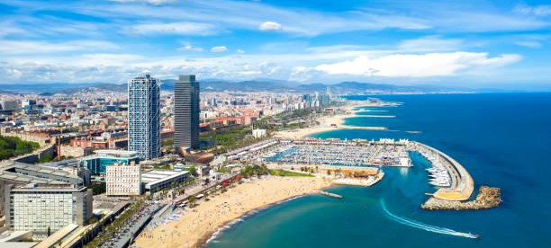
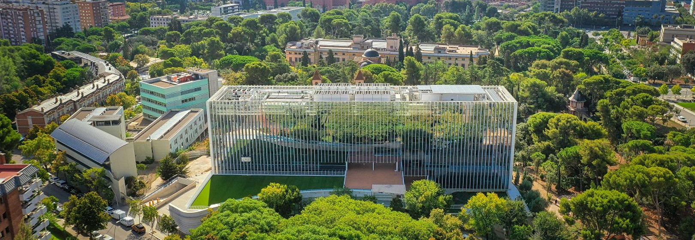

We are seeking a motivated candidate for a 12-month post-doctoral position in Operational Research at Universitat Pompeu Fabra in Barcelona, Spain.

  <a style="background: #FF7F50; font-size: 125%; font-weight: bold; padding: 30px; border-radius: 20px; color: white !important; text-decoration: none;" href="https://forms.gle/2Y5XWquvHmKz52Bj9">Apply now!</a>

  

## The research project

The post-doctoral researcher will be financed through the research project "Fairness and social well-being in optimisation models".
The overarching theme of this project is incorporating ethical aspects into mathematical models for public resource allocation and labour organisation.
Specifically, the project aims to include fairness and social well-being considerations in optimisation models through two research lines: fairness in public budget allocation models and workers' well-being in service industry optimisation models.

The researcher will join the [Statistics, Probability and Machine Learning](https://www.upf.edu/web/statistics-group) research group.
The IP of the project is [Alberto Santini](/files/cv.pdf), associate professor of Operational Research at Universitat Pompeu Fabra.
Among his publications, the ones that most align with this project are the following:
* Malaguti, E., Paronuzzi, P., & Santini, A. (2026). [Algorithms and Complexity Results for the 0–1 Knapsack Problem with Group Fairness](/files/papers/malaguti-paronuzzi-santini-2026.pdf).
* Mandal, M. P., Santini, A., & Archetti, C. (2025). [Tactical workforce sizing and scheduling decisions for last-mile delivery](/files/papers/mandal-santini-archetti-2025.pdf).
* Delle Donne, D., Santini, A., & Archetti, C. (2025). [Integrating Public Transport in Sustainable Last-Mile Delivery: Column Generation Approaches](/files/papers/delle-donne-santini-archetti-2025.pdf).
* Santini, A., Viana, A., Klimentova, X., & Pedroso, J.P. (2022). [The probabilistic travelling salesman problem with crowdsourcing](/files/papers/santini-viana-klimentova-pedroso-2022.pdf).

We also particularly encourage interdisciplinary research with professors in adjacent areas (e.g., the [Data Science Centre](https://datascience.bse.eu/team-gse/)).

  

## Requirements

* Candidates will have completed a **PhD** in Operational Research, Computer Science, Mathematics, Computer Engineering, Economics, or other areas closely related to operational research and mathematical optimisation.
* All candidates will be evaluated based on their academic accomplishments, previous research experience, and fit with the project.
* Candidates must have excellent English and scientific writing skills.
* Candidates with proven experience in at least one of the following areas are particularly encouraged to apply:
  * Rostering and scheduling problems
  * Exact methods based on column generation
  * Multi-objective optimisation
  * Bi-level programming and Stackelberg games

  

## What we offer

* A 12-month contract with a minimum salary of around 31200 euros per year.
* The candidate is expected to focus solely on research and will not have any teaching or administrative duties. If they want to gain teaching experience, this can also possibly be arranged and is paid separately.
* The scholarship comes with funding to cover research expenses, such as travelling to conferences or stays abroad.
* UPF offers plenty of opportunities for career growth, including research and soft-skills seminars.
* The university also has a comprehensive language-learning programme.

  

## Timeline

* Please complete the [form](https://forms.gle/2Y5XWquvHmKz52Bj9) as soon as possible and, in any case, before March 27. Remember to include your CV and a recommendation letter.
* We will be reviewing applications and scheduling interviews continuously. During the interviews, we will explain how to submit your application through the official university system.
* Around two weeks after the end of the application procedure, a ranked list of candidates will be published, and the highest-ranked candidate will be offered the position.
* In case of declining candidates, the position will be offered according to the ranking.
* The contract will start at a mutually agreed date in 2026.

  

## More information

* [Universitat Pompeu Fabra](https://www.upf.edu/) is a young, research-oriented, world-class university. It is usually ranked number one in Spain and in the top 20 young universities worldwide.
* The [Department of Economics](https://www.upf.edu/en/web/econ) is considered among the most prestigious in Europe and worldwide (ranked 24th worldwide in the QS ranking). It is highly international, with professors from over twenty countries and PhD students from around the world.
* Furthermore, working in Operational Research, you will have frequent contacts with many other groups, such as the [Data Science Centre](https://datascience.bse.eu/) at the Barcelona School of Economics.
* Your reference campus is UPF's [Ciutadella campus](https://www.upf.edu/web/campus/campus-ciutadella), located next to a large park (and zoo) and close to both the city centre and the beach.
* Barcelona offers a very high quality of life with its active cultural life, an extensive public transport system, and innumerable opportunities for outdoor and sportsy activities.

For any other information, please contact [Alberto Santini](mailto:alberto.santini@upf.edu).
